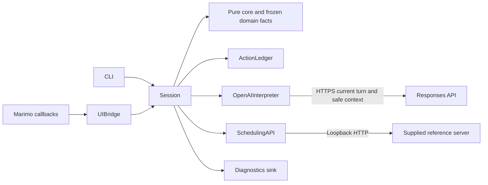
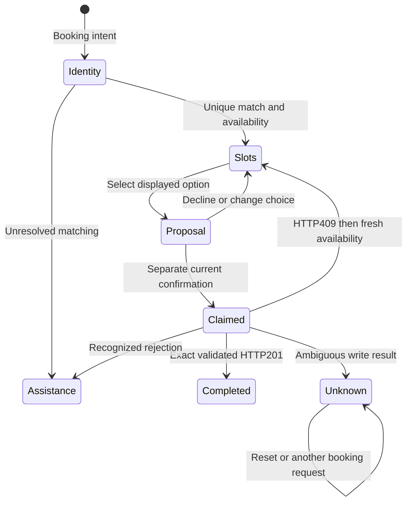

# As-built architecture

Updated: 2026-10-09. Latest reviewed application source: `8716779d10c4498cdd3cf3a8d62f7fd1c03d0537` (approved Persona follow-on).

Actual source, navigation and diagrams reviewed. Both fresh Mac/Minty clones pass 118 tests and both supplied-HTTP demos. RC-2 records the earlier full genuine CLI/IAB qualification. The latest Persona follow-on passed actual affected CLI guidance and both-host IAB numbered recovery, keyboard confirmation and support-context checks. No CLI authorization gap remains. See [canonical verification](../scheduling-verification.md); native tasks own progress.

Navigation: [README](../../../README.md) · [code walkthrough](code-walkthrough.md) · [decisions](../../product/decisions.md) · [planned architecture](../../../specs/001-scheduling-assistant/plan.md) · [interaction contract](../../../specs/001-scheduling-assistant/contracts/interaction.md) · [service contract](../../../specs/001-scheduling-assistant/contracts/scheduling-service.md).

## Components and ownership

| Actual component | Responsibility and boundary |
| --- | --- |
| [CLI](../../../src/scheduling_assistant/__main__.py) | Validates explicit model/environment configuration, creates one Session, generates event IDs, prints processing feedback and shared views; no independent booking policy. |
| [Marimo app](../../../apps/scheduling_app.py) and [UIBridge](../../../src/scheduling_assistant/ui_bridge.py) | Form/button callbacks submit events with the displayed revision. Immutable transcript snapshots, HTML escaping and a nonblocking bridge lock protect presentation; rendering never calls the model or service. Reviewed local [assets](../ui-assets.md) supply theme/logo. |
| [Session](../../../src/scheduling_assistant/session.py) | Serializes turns; retains preferences and private matching state; rejects stale controls and deduplicates events; renders authoritative messages; owns current proposals, consent and API dispatch. |
| [Domain](../../../src/scheduling_assistant/domain.py) and [pure core](../../../src/scheduling_assistant/core.py) | Frozen returned facts, preferences, proposals and views; calendar/type validation; displayed-slot selection; standalone affirmative recognition; exact appointment/proposal comparison. ActionLedger claims an action before dispatch and preserves effect certainty. |
| [Interpretation](../../../src/scheduling_assistant/interpretation.py) and [OpenAI adapter](../../../src/scheduling_assistant/openai_adapter.py) | Genuine current-turn text extraction through HTTPS Responses; strict required nullable fields, no additional fields or effect authority. Incomplete/refused/malformed responses stop progression. |
| [SchedulingAPI](../../../src/scheduling_assistant/scheduling_api.py) | Only four implemented operations: providers, patient search, availability and booking. Validates loopback configuration, bounded JSON, returned types/IDs/filters and exact booking evidence; translates errors without raw upstream messages. |
| [Diagnostics](../../../src/scheduling_assistant/diagnostics.py) | Bounded in-memory allowlisted operation/state/intent/outcome/reason and elapsed milliseconds. Arbitrary strings, identity, keys, queries, bodies and raw exceptions are discarded. |
| [Supplied reference server](../../../vendor/scheduling-reference/mock-api/server.py) | Separate HTTP process owns synthetic providers/patients/slots and in-memory bookings. The application uses HTTP, never fixture-only conflict flags. [Provenance](../../../vendor/scheduling-reference/PROVENANCE.md) records unchanged source hashes. |

Session owns orchestration; the two adapters perform separate model and scheduling effects. The model interprets text, the service supplies scheduling facts, and local code decides whether a write is permitted and whether its result proves completion. There is no additional backend, database, rules engine, appointment-lookup implementation or handoff-delivery service.

## Identity, consent and outcome boundaries

Provider discovery calls `/providers` without patient identification. Booking collects phone and calendar-valid DOB for `/patients/search`. Only one validated candidate, or one candidate remaining after private local ZIP filtering, permits patient-specific availability. ZIP is not an invented API parameter; candidate demographics are not displayed. Changed matching inputs or preferences invalidate the proposal and returned choice state. Phone/DOB changes also clear an earlier ZIP, and changed identity/preferences clear completed-appointment presentation and the old conflict-exclusion cycle. Missing identity prompts ask only for the missing answer. Two unsuccessful searches exhaust the one correction opportunity until reset.

The model receives the current synthetic user turn plus allowlisted state, intent, supported preferences, required-answer state and slot count. Stored patient candidates/IDs, returned slot objects, credentials and prior raw transcript are excluded from generated context. The current turn may itself contain synthetic phone/DOB/ZIP for extraction. `store:false` is set; this is not a claim of production privacy certification. Model prose never becomes an authoritative clinical answer, booking result or confirmation flag.

Availability must contain literal `available:true`, unique IDs, valid offset timestamps and facts matching requested filters. Display preserves returned `startTime`, including the fixture's fixed `-05:00` offset. Selection resolves against displayed returned choices. A later standalone affirmative confirms the unchanged exact patient/slot proposal; a same-turn choice plus “yes”, stale control, decline or mixed conditional reply cannot authorize the write. The extraction prompt explicitly preserves unsupported specialty/location/type values and classifies them as unsupported. Local DomainError handling independently supplies supported-scope/date guidance and clinic assistance for invalid values. Model interpretation remains fallible and never grants authority.

This diagram summarizes the booking path, rather than every View state. Identity/preferences changes also clear pending consent; advice, human and unsupported/lookup requests stop scheduling and provide factual clinic-staff guidance. No queued handoff or staff delivery is claimed.

Before POST, ActionLedger atomically claims the proposal. Only HTTP201 with a nonempty appointment identifier, `scheduled` status and matching patient/provider/specialty/location/startTime permits “booked.” Recognized 400/409 and the supplied pre-effect 503 establish rejection. A conflict clears consent, refreshes availability and suppresses the rejected ID before fresh selection/confirmation. Timeout, disconnect, malformed/mismatched success or unrecognized write response remains unknown; an explicit urllib connection refusal before dispatch is distinguished from uncertainty. There are no automatic retries, redirect following or idempotency keys.

## Presentation, diagnostics and retention

CLI and UI call the same `Session.submit(text, event_id, expected_revision)` boundary. Session caches event views; the UI additionally retains seen event IDs so old events cannot restore pre-reset transcript content. Its pending lock rejects overlapping submissions and generated callbacks bind the displayed revision. These checks complement the core consent guard. `mo.state(..., allow_self_loops=True)` rebuilds the submitting controls after callbacks update the snapshot; a real pinned-Marimo callback/scheduler regression protects against disappearing controls. Controlled IAB journeys passed at the qualified baseline on both hosts; this does not certify all browser/accessibility behavior. The current app narrowly hides Marimo’s framework notebook-actions dropdown using its `data-testid="notebook-actions-dropdown"` CSS hook, avoiding an unreliable export action outside the scheduling flow. This is presentation customization, not an authorization/security boundary; actual final-source IAB rehearsal covered the resulting interface on both hosts.

Session `_call` and `_emit` measure model, scheduling-operation and whole-turn durations with a monotonic clock. Both CLI `_session` and UI `configured_bridge` now inject Diagnostics, with an actual configured-UI turn regression. Safe no-match, ambiguous-identity and unsupported reasons accompany whole-turn events. The sink has no HTTP-status field or persisted log exporter; service status evidence is separate from these bounded in-memory events. Diagnostics failure cannot retry or change an effect.

Conversation reset clears matching/proposal state and the displayed UI transcript, while the default process-global `PROCESS_ACTIONS` ledger remains. Independent UI bridges have separate conversation histories, but sessions sharing that ledger conservatively share its unknown-write block. Test/demo sessions inject fresh ledgers. Session event caches and live conversation state are memory-only; reset is not secure memory erasure. Process loss destroys this evidence and cannot establish that a remote write failed. There is no durable reconciliation endpoint or safe retry-clear control.

## Evidence and limits

[Domain tests](../../../tests/test_scheduling_core.py), [Session tests](../../../tests/test_scheduling_session.py), [API tests](../../../tests/test_scheduling_api.py), [AI tests](../../../tests/test_scheduling_ai.py), [UI tests](../../../tests/test_scheduling_ui.py), [CLI tests](../../../tests/test_scheduling_interfaces.py) and [diagnostic tests](../../../tests/test_scheduling_diagnostics.py) exercise the respective boundaries. [Integration tests](../../../tests/test_scheduling_integration.py) run fresh supplied HTTP services on ephemeral ports, including real committed booking with a deliberately lost reply, conflict recovery, private ZIP matching and no-match/outage cases. The [success/failure script](../../../scripts/demo_scheduling.py) labels its interpreter simulated and checks actual HTTP outcomes; it is not live AI evidence.

Earlier application e0996c1 passed 114 tests/demos and full genuine IAB provider/booking/reset/no-match/unsupported flows on both hosts. Post-checkpoint actual CLI provider/booking/no-match passed on both hosts at 3a3091c, resolving the earlier rejected rerun. Latest application8716779 passes118 tests/demos on both hosts; actual affected CLI and both-host IAB support guidance, numbered recovery and keyboard confirmation passed. Source-specific details remain in [verification](../scheduling-verification.md). No tests were rerun solely for documentation cleanup.

Operational limits: synthetic identity matching is not authentication; user text can be misinterpreted by AI; memory/state is local and non-durable; the service is a supplied mock with relative fixture dates and a fixed offset; model completion may take up to its configured 30-second transport timeout and scheduling calls default to five seconds. Consult the canonical verification record for scenario-specific latency observations; this architecture review establishes no 400 ms or load-performance guarantee. Existing appointment retrieval, rescheduling/cancellation and recorded handoffs are deferred. Consult [milestones](../milestones.md) for reviewed checkpoints rather than treating a source-review document as a release milestone.

## Reviewed source and diagram verification

Reviewed application source `e0996c1c8a438b6b6bfeff5283b5b3b02ddd8e69` includes `src/scheduling_assistant/{__init__,__main__,domain,core,session,interpretation,openai_adapter,scheduling_api,diagnostics,ui_bridge}.py`, `apps/scheduling_app.py`, `scripts/demo_scheduling.py` and `tests/test_scheduling_{core,session,api,ai,interfaces,ui,diagnostics,integration}.py`. The DomainError guidance and narrow menu selector are committed, as are explicit unsupported-intent extraction examples and their request-contract regression.

Both actual architecture Mermaid blocks rendered as SVG in controlled IAB using disposable pinned Mermaid 11.12.0. The qualification owner visually checked the module/effect arrows and booking outcome paths; screenshot evidence stays outside Git. Navigation and referenced symbols were checked against actual files. No repository/global renderer dependency was added. The surrounding prose also explains the boundaries without requiring diagram rendering.

Post-checkpoint evidence update: genuineCLI provider/booking/no-match passed bothhosts at3a3091c afterdirectOperatorauthorization; this resolves the earlier latestCLIrerun gap. Applicatione0996c1 unchanged; [verification](../scheduling-verification.md) is canonical.

## Persona follow-on source review —2026-10-09

Latest application8716779: `Session._support_context` renders a local privacy-preserving Known/Missing/Bookingoutcome summary for human intent. `_booking_outcome` is reset with changedidentity/preferences and tracks completed/knownrejected/unknownwrites; processledgerunknownwins evenafterreset. The humanView preservescertainty and unknownDoNotRetrywarning; no new service/deliveryeffect. `PersonaBehaviorTests` codify existingnumberedrecovery/failed-modelconsent and tests-firstsupportfix; actualHTTP lostresponse regression includes humanhelp.118tests/demosfreshbothhosts, actualCLI andMac/MintyIAB affectedguidance/keyboardflows passed. Existing module/state diagrams retaincorrectboundaries; no new architecturecomponent. Exactpins/cards and source map in [Personas](../../product/personas.md), canonical [verification](../scheduling-verification.md).
