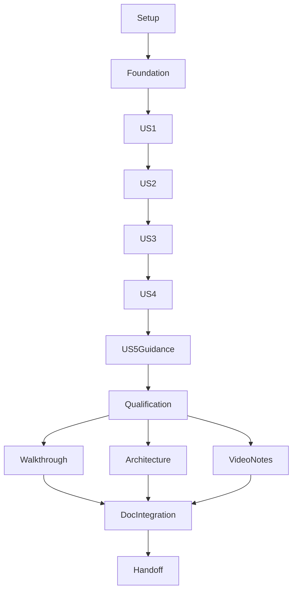

# Tasks: AI Appointment Scheduling Assistant

**Input**: Design documents in `specs/001-scheduling-assistant/`.
**Prerequisites**: [plan.md](plan.md), [spec.md](spec.md), [research.md](research.md), [data-model.md](data-model.md), [interaction contract](contracts/interaction.md), [service contract](contracts/scheduling-service.md), [quickstart.md](quickstart.md), and [approved Q1](scope-decisions.md).
**Generated**: 2026-10-08. Implementation in progress; checkboxes below record verified work.
**Tests**: Required tests-first by FR-013, Constitution and project agreement. Write meaningful assertions, run them and observe the intended failure before implementing the corresponding behavior; then run green and regression checks. Test doubles qualify boundaries, not live AI or actual HTTP integration.
**Organization**: Story phases follow native US1–US5. US5 implements only required deferred-scope guidance. No optional appointment retrieval, recorded handoff, admin console, rules engine or remote work is selected.

## Format: `[ID] [P?] [Story] Description`

- `[P]` indicates eligible disjoint-file work after its stated prerequisites are satisfied, not permission to run dependent code before tests.
- Story labels map to spec.md. Setup, foundation and polish have no story labels.
- Paths are project-relative. Keep managed bootstrap/template sources, controls, Constitution, existing hooks/configuration and approved asset bytes intact. Add application code alongside the starter.
- Primary-user and Support/Admin Personas remain unresolved placeholders; selection/validation is follow-on work, not a new implementation gate.

## Phase 1: Setup (Shared Infrastructure)

**Purpose**: Establish local prerequisites and reproducible independent service inputs.

- [x] T001 Verify an explicit Python 3.11+ executable and create project-local `.venv/`; declare `marimo==0.25.0` in `pyproject.toml`, retain bootstrap dependencies/entry points, install locally and smoke-check compatibility without global tooling changes.
- [x] T002 [P] Selectively copy only the supplied OpenAPI, `mock-api/server.py`, guide and four synthetic fixtures from `docs/product/RFP/source/` into `vendor/scheduling-reference/`; record source paths/checksums and internal-use provenance in `vendor/scheduling-reference/PROVENANCE.md`, retain independent in-memory server behavior and exclude original intake metadata/unrelated attachments.
- [x] T003 [P] Establish empty application package/module and test discovery structure from plan.md in `src/scheduling_assistant/__init__.py` and `tests/__init__.py`, leaving `src/poc_demo/` and `src/poc_template/` untouched; do not add behavior before its failing tests.
- [x] T004 Document verified interpreter/install, port checks for 4010/28180 and owned-service startup in `docs/user/setup.md`; never terminate unrelated listeners or equate the starter demo with scheduling qualification (depends on T001–T003).

## Phase 2: Foundational (Blocking Prerequisites)

**Purpose**: Stabilize shared types, effect boundaries and safe transport before story implementation.

- [x] T005 Write failing validation/state tests in `tests/test_scheduling_core.py` for every entity constraint in data-model.md, including typed fields, duplicate identifiers, missing arrays, calendar dates, invalid filters and valid empty results; assert invalid input cannot become authoritative state.
- [x] T006 Implement conversation, preferences and private identity types in `src/scheduling_assistant/domain.py` after T005: Conversation constraint "Session-local, serial updates; no cross-session history promise; no raw transcript logging"; Preferences constraint "Accepted enum only; actual ISO calendar dates and start<=end; unsupported types stop workflow; changes invalidate displayed options/proposal"; Identity input constraint "Validate nonempty phone and ISO calendar DOB; preserve supplied phone format for exact service match; ZIP string preserves leading zeros; memory only"; Patient candidate constraint "Valid typed service result, no user-selected IDs; candidates private, never logged or passed to model; phone/DOB match query"; Resolved identity constraint "Exactly one validated candidate from search/ZIP; input changes invalidate identity and proposal; matching is not authentication".
- [x] T007 Implement returned-fact, proposal and outcome types in `src/scheduling_assistant/domain.py` after T006: Provider constraint "Returned typed fields, unique IDs, matching requested filters; no inference of availability"; Slot snapshot constraint "Returned available=true, unique IDs, valid offset date-time, matching filters; displayed with supplied offset; snapshots can become stale"; Booking proposal constraint "Bound to displayed returned slot and resolved patient; new patient/preference/slot supersedes it; IDs are internal, not model authority"; Action record constraint "Atomic transition before POST; immutable success retained; unknown guard persists at process scope across conversation reset"; Appointment constraint "Only HTTP201, nonempty ID, scheduled status, exact patient and all available slot detail comparisons; API has no slotId in result"; Recovery context constraint "No sensitive summary; no queued/delivered claim; uncertainty survives reset as safety warning".
- [x] T008 [P] Write failing HTTP-boundary tests in `tests/test_scheduling_api.py` for URL encoding, loopback-only base URL, 5-second timeout, 1 MiB response cap, JSON/type/status errors, no automatic retries and no consequential POST redirect following (after T007).
- [x] T009 [P] Write failing structured-interpretation tests in `tests/test_scheduling_ai.py` for strict required nullable fields, no additional properties, supported intent enum and rejection of patient IDs/created facts/confirmation authority; assert model failure/refusal cannot authorize effects (after T007).
- [x] T010 Implement injected scheduling transport and safe error classification in `src/scheduling_assistant/scheduling_api.py` after T008; keep endpoint-specific operations for story tasks, no raw HTTP debugging and no retry middleware.
- [x] T011 Implement validated interpretation protocol in `src/scheduling_assistant/interpretation.py` after T009, with fields `intent`, `specialty`, `location`, `appointment_type`, `phone`, `dob`, `zip`, `start_date`, `end_date`, `slot_choice`; require all fields, nullable where inapplicable, no extra properties and no effect authority.
- [x] T012 Write failing serial-session tests in `tests/test_scheduling_session.py` for event-ID deduplication, overlapping turns, immutable views, proposal-revision binding and process-level unknown guard surviving conversation reset; assert operation counts, not only text (after T010–T011).
- [x] T013 Implement shared `Session.submit(text, event_id)` orchestration skeleton in `src/scheduling_assistant/session.py` after T012, with serial ownership, pre-dispatch atomic action claim, duplicate-event view reuse and a process-scope unresolved-effect registry; introduce injectable core/interpreter/gateway and allowlisted diagnostic hook, not booking behavior yet.

**Checkpoint**: T001–T013 green and integrated; foundation blocks all story implementation. No live/runtime or booking claim follows from this checkpoint.

## Phase 3: User Story 1 — Find providers (Priority: P1)

**Goal**: Genuine multi-turn discovery with no identity demand, using only returned providers in CLI and Marimo.
**Independent Test**: Omit a useful preference, answer the follow-up and compare displayed downtown primary-care providers to actual supplied API responses; assert no patient search/availability/POST.

### Tests for User Story 1

- [x] T014 [P] [US1] Add failing provider-contract tests to `tests/test_scheduling_api.py` for GET `/providers`, optional specialty/location, returned filters/unique IDs, empty arrays, malformed results and 400/503; no fixture reading by runtime.
- [x] T015 [P] [US1] Add failing discovery tests to `tests/test_scheduling_core.py` for retained preferences, optional provider filters, missing-answer clarification, unsupported/empty results, returned-only facts and zero identity questions or patient-specific operations.
- [x] T016 [P] [US1] Add failing Responses-adapter tests to `tests/test_scheduling_ai.py` using injected HTTPS responses: explicit model and environment key, `store:false`, strict `text.format` schema, completed output-text only, refusal/incomplete/invalid output, finite 30-second timeout, bounded output and no automatic retry or raw logging.

### Implementation for User Story 1

- [x] T017 [P] [US1] Implement provider operation/validation in `src/scheduling_assistant/scheduling_api.py` after T014; specialties `primary_care`/`dermatology`, locations `downtown`/`uptown`/`lakeside`, service facts only and translated safe errors.
- [x] T018 [P] [US1] Implement direct HTTPS Responses interpreter in `src/scheduling_assistant/openai_adapter.py` after T016, using current synthetic turn and minimal safe workflow context only; never send stored candidates, IDs, raw prior transcript or key in model content, and never display model prose as clinical/scheduling authority.
- [x] T019 [US1] Implement discovery transitions and deterministic returned-provider rendering in `src/scheduling_assistant/core.py`, then connect `src/scheduling_assistant/session.py` after T015/T017/T018; disclose AI use and retain useful answers without inventing API-required fields.
- [x] T020 [US1] Write failing interface tests in `tests/test_scheduling_interfaces.py` for live-interpreter wiring, discovery parity, help/missing config without model call, one submitted event per turn, rerender/double-click deduplication, escaped content and separate browser-session state (after T019).
- [x] T021 [P] [US1] Implement thin terminal adapter in `src/scheduling_assistant/__main__.py` after T020: explicit `--model`, environment OPENAI_API_KEY, loopback4010 default `--api-base-url`, labeled local `--scenario api_failure`, multi-turn display, prompt processing feedback, `reset` and `quit`, with no key value in errors.
- [x] T022 [P] [US1] Implement thin submitted form/transcript in `apps/scheduling_app.py` after T020: explicit SCHEDULING_MODEL, environment key, loopback28180 launch, session isolation, immutable escaped transcript, pending-submit disabling, AI disclosure and local reviewed `assets/ui/branding/ochsner-health.svg` plus `assets/ui/themes/ochsner.css`; inspect asset content, use no tracking/hotlinks and leave approved bytes unchanged.
- [x] T023 [US1] Add and run discovery integration in `tests/test_scheduling_integration.py` with owned independent supplied server after T021–T022; compare actual HTTP responses/operation counts with both adapters' shared views, observe meaningful red before new integration wiring and record sanitized automated evidence in `docs/internal/scheduling-verification.md`.

**Checkpoint**: Discovery works independently. This is the first usable increment, not the complete required MVP.

## Phase 4: User Story 2 — Confirm and book an appointment (Priority: P1)

**Goal**: Unique patient resolution, API availability, exact subsequent consent and exactly one validated booked outcome.
**Independent Test**: Supplied unique synthetic match selects a returned non-conflict slot, declines once, reselects and confirms later; one HTTP201 matching appointment, no POST before confirmation and no extra POST on repeated confirmation.

### Tests for User Story 2

- [x] T024 [P] [US2] Add failing patient/availability/booking contract tests in `tests/test_scheduling_api.py` for GET `/patients/search?phone=...&dob=...`, GET `/availability` with resolved patient/specialty and optional filters, POST `/appointments` with stored patientId/slotId and literal `confirmed:true`; reject 200, absent/invalid appointment and mismatched201 as success.
- [x] T025 [P] [US2] Add failing booking tests in `tests/test_scheduling_core.py` for input/date/scope validation, unique phone+DOB match, displayed-only slot selection, supplied time offset and immutable exact patient-bound proposal; absent/declined/ambiguous/changed/stale consent performs zero POST and completed confirmation cannot replay.
- [x] T026 [P] [US2] Add failing effect-session tests in `tests/test_scheduling_session.py` for subsequent-turn consent, exact generations/revisions, atomic once-only dispatch, duplicated event, concurrent confirmation, interruption after dispatch, and reset retaining unknown warning/blocking new POST.
- [x] T027 [P] [US2] Add failing CLI/UI booking parity tests in `tests/test_scheduling_interfaces.py` for selected proposal details, standalone consent, stale UI confirm controls, rerenders/double clicks, decline/change/reset, EOF/interruption and repeated success confirmation.

### Implementation for User Story 2

- [x] T028 [US2] Implement private patient search in `src/scheduling_assistant/scheduling_api.py` after T024; URL-encode exact phone/DOB, validate match-query consistency, retain candidates only in private memory and never accept user/model-selected patientId.
- [x] T029 [US2] Implement availability and appointment operations in `src/scheduling_assistant/scheduling_api.py` after T028; validate returned filters/available flags/offset dates and require exactly201 with nonempty appointmentId, scheduled status and exact stored patient/provider/specialty/location/startTime before success.
- [x] T030 [US2] Implement unique-match identity and preference validation/transitions in `src/scheduling_assistant/core.py` after T025/T028; require resolved identity before patient-specific availability, invalidate identity/proposal on identity change and options/proposal on preference change; duplicate/no-match paths remain stopped pending US3.
- [x] T031 [US2] Implement returned-slot choice and full proposal rendering in `src/scheduling_assistant/core.py` after T029/T030, with provider reference, specialty, location and startTime including supplied offset; no undisplayed choice or guessed slot, and no consent inherited from another proposal.
- [x] T032 [US2] Implement consent guard in `src/scheduling_assistant/core.py` after T031: subsequent standalone case-insensitive `yes`, `confirm`, `yes, book it` with surrounding whitespace/punctuation trimmed; mixed changes/conditions stay ambiguous, decline clears proposal, new patient/preferences/slot require fresh consent, and AI extraction cannot confirm.
- [x] T033 [US2] Integrate once-only action ledger and validated result views in `src/scheduling_assistant/session.py` after T026/T029/T032; claim in-flight before POST, retain known success for repeated confirmation and classify dispatched uncertain writes as unknown with process-level blocking across reset.
- [x] T034 [P] [US2] Extend thin CLI proposal/confirmation/result/interruption presentation in `src/scheduling_assistant/__main__.py` after T027/T033; use shared core views and preserve unknown warnings on reset/exit without claiming a restart resolved them.
- [x] T035 [P] [US2] Extend thin Marimo proposal-bound confirmation and result/status controls in `apps/scheduling_app.py` after T027/T033; no write on cell rerender, stale control or repeated click, and no cross-session identity leakage.
- [x] T036 [US2] Add/run actual-server booking integration in `tests/test_scheduling_integration.py` after T034–T035; test proposal/result equality, exactly one POST, no POST before/after repeated consent and fresh owned server state; do not assert canned dates or fixture metadata.
- [x] T037 [US2] Implement labeled deterministic provider-plus-booking success demo in `scripts/demo_scheduling.py` after T036 using scripted interpreter and actual supplied HTTP server; assert later-turn consent and exactly one POST, select from current returned options and label evidence as integration rather than live AI.

**Checkpoint**: Core happy-path booking verified; required failures, live AI qualification and support evidence remain open.

## Phase 5: User Story 3 — Resolve identity safely and obtain help (Priority: P1)

**Goal**: Bounded private recovery and truthful assistance for every reachable safety failure.
**Independent Test**: No match, unique/zero/multiple private ZIP matches, advice/human/unsupported requests, empty slots,409,503 and injected unknown writes; inspect actual operation counts and zero unsafe disclosure/fabricated success.

### Tests for User Story 3

- [x] T038 [P] [US3] Add failing recovery tests in `tests/test_scheduling_core.py` for one no-match correction opportunity then assistance, one private ZIP clarification yielding zero/multiple/unique matches, no candidate demographics, unsupported scope/advice/human stopping calls and accurate empty availability guidance.
- [x] T039 [P] [US3] Add failing HTTP recovery tests in `tests/test_scheduling_api.py` for 400 correction,409 conflict, supplied pre-effect503, unexpected write status, malformed/mismatched201, timeout-after-write, connection/interruption ambiguity and no redirects/retries; distinguish safe pre-dispatch failure from uncertain dispatch.
- [x] T040 [P] [US3] Add failing recovery-controller tests in `tests/test_scheduling_session.py` for409 clearing consent, fresh availability excluding rejected slot for this recovery, fresh choice/confirmation, refusal/model failure stopping writes, and unknown guard blocking new proposals after reset without an invented reconciliation endpoint.

### Implementation for User Story 3

- [x] T041 [US3] Implement bounded no-match correction/private local ZIP filtering in `src/scheduling_assistant/core.py` after T038; exactly one candidate permits proceeding, otherwise stop patient actions and advise clinic scheduling staff, preserving ZIP leading zeros and revealing no candidate demographics.
- [x] T042 [US3] Implement medical-advice/human/unsupported/empty-result recovery in `src/scheduling_assistant/core.py` after T041; give reason-specific practical assistance, no clinical answer/triage, invented phone number, queued request, delivered transfer or unsupported operation.
- [x] T043 [US3] Implement error/unknown mapping in `src/scheduling_assistant/scheduling_api.py` after T039; translate allowlisted codes without upstream raw text, only recognized valid contract rejections establish known failure, and all unrecognized dispatched write results preserve uncertainty.
- [x] T044 [US3] Integrate conflict refresh and unknown recovery in `src/scheduling_assistant/session.py` after T040/T042/T043; invalidate consent on409, suppress the rejected returned ID only in that recovery cycle, require fresh choice/consent and retain unknown guard/warning without any retry/clear control or optional appointment lookup workaround.
- [x] T045 [US3] Add/run actual supplied-server no-match, duplicate-ZIP, empty availability,409 and explicit `api_failure` integration in `tests/test_scheduling_integration.py` after T044; assert privacy, operation/status counts and fresh-confirmation recovery, while retaining injected transport tests for uncertainty not reproducible by the stock server.
- [x] T046 [US3] Add deterministic no-match failure mode to `scripts/demo_scheduling.py` after T045; actual HTTP search, zero availability/POST, no patient disclosure and specific clinic-staff guidance; record both success/failure outputs and sanitized operation counts in `docs/internal/scheduling-verification.md` without raw sensitive transcripts.

**Checkpoint**: US1–US3 safety paths integrated. Neither fixtures nor scripted demos substitute for live qualification in both interfaces.

## Phase 6: User Story 4 — Inspect safe recovery context (Priority: P2)

**Goal**: Useful Support/Admin diagnostics and recovery instructions without a new console or sensitive logs.
**Independent Test**: Success, error and unknown-effect runs reveal intent/state, operation, outcome, safe escalation reason and measured elapsed time; inspect diagnostic/stdout/stderr artifacts for zero sensitive values and instructions for no blind retry.

### Tests for User Story 4

- [x] T047 [P] [US4] Write failing allowlist/leakage tests in `tests/test_scheduling_diagnostics.py` for successful/error service/model operations and malicious upstream exceptions; Diagnostic event constraint "Explicit allowlist; no query/body/transcript/IDs/phone/DOB/ZIP/secrets/raw exception text"; include static synthetic sentinel detection without displaying leaked values.
- [x] T048 [P] [US4] Add failing integrated output-capture tests in `tests/test_scheduling_interfaces.py` for CLI/UI diagnostic parity and sanitized stdout/stderr; distinguish intended transient user-facing details from persisted diagnostics, and ensure reset clears transcript but retains safe unknown warning.

### Implementation for User Story 4

- [x] T049 [US4] Implement allowlisted events and monotonic durations in `src/scheduling_assistant/diagnostics.py` after T047; operation/state/intent, status or safe outcome/error/escalation code and durationMs only, no arbitrary exception/model payload logging.
- [x] T050 [US4] Wire shared safe observability into `src/scheduling_assistant/session.py`, `src/scheduling_assistant/scheduling_api.py`, `src/scheduling_assistant/openai_adapter.py` and thin adapters after T048/T049; run combined leakage tests, separate model/service/completion time and give processing feedback without unsupported performance guarantees.
- [x] T051 [US4] Populate `docs/internal/scheduling-recovery.md` from observed outcomes after T050: attempted/completed/known-rejected/unknown distinctions, clinic verification before uncertain retry, reset/process-loss limitations, synthetic matching versus production authentication and no handoff-delivery claim; link canonical diagnostics and evidence.

**Checkpoint**: Required observability and Support/Admin coverage complete without inventing a console or pinned Persona.

## Phase 7: User Story 5 — Existing appointment lookup guidance (Priority: P2; retrieval deferred)

**Goal**: Satisfy US5.3 in MVP; US5.1–2 remain conditional follow-on scope.
**Independent Test**: Request existing appointments in CLI and UI; receive truthful unsupported-scope explanation and practical clinic-staff guidance, with no lookup endpoint or handoff POST.

### Tests for User Story 5

- [x] T052 [US5] Add failing deferred-lookup acceptance/parity tests in `tests/test_scheduling_interfaces.py` for US5.3, including lookup during pending booking; assert no `/patients/{patientId}/appointments`, `/handoffs` or appointment POST and no fabricated retrieval/engagement.

### Implementation for User Story 5

- [x] T053 [US5] Route `appointment_lookup` to stopped-workflow guidance in `src/scheduling_assistant/core.py` after T052; invalidate pending booking consent as appropriate and offer actual clinic-staff assistance without fetching appointments or inventing staff engagement.
- [x] T054 [US5] Document retrieval and recorded handoff as explicitly deferred in `docs/user/limitations.md` after T053, retain duplicate-match booking protection as required and link conditional US5.1–2 acceptance in `specs/001-scheduling-assistant/spec.md` without duplicating story status.

**Checkpoint**: Required US5 guidance independently verified; no retrieval feature is selected.

## Phase 8: Polish & Cross-Cutting Concerns

**Purpose**: Qualify the complete required lane, then finalize actual-code documentation and honest handoff.

- [x] T055 Run `PYTHONPATH=src python3 -m unittest discover -s tests -v` under verified Python 3.11+ (or documented `.venv/bin/python` equivalent), then both `scripts/demo_scheduling.py --scenario success` and `--scenario failure` against fresh owned supplied-server state; record counts, actual statuses and failures in `docs/internal/scheduling-verification.md` after T023–T054, without claiming scripted runs are live AI.
- [x] T056 Qualify actual genuine multi-turn provider/booking/no-match flows in CLI and Marimo as specified in `specs/001-scheduling-assistant/quickstart.md` after T055, using only an already authorized runtime environment key and explicit configurable model (`gpt-5.4-mini` target); record sanitized date/model/environment/turn/operation counts and actual results in `docs/internal/scheduling-verification.md`, include refusal-before-confirmation and repeat-confirmation checks, and report unavailable runtime/model evidence honestly without substituting scripted qualification. Existing Operator authorization permits the trusted Bitwarden helper for `[Env] OPENAI_API_KEY` notes into process-local environment for local qualification only; never print, log, persist or pass the key in argv. Reviewer runtime accepts ordinary environment configuration and has no Bitwarden dependency.
- [x] T057 Review real browser behavior of `apps/scheduling_app.py` after T056: approved visible logo/colors, safe local asset references, escaped user/service text, labels, keyboard/focus, useful status, rerender/double-submit/stale-confirmation guards, session isolation and reset; update concise source/use index `docs/internal/ui-assets.md` and record observed limitations without a blanket accessibility claim.
- [x] T058 Measure useful-feedback target400 ms and separate completion/service/model latency for declared single-user scenarios/load/environment in both interfaces after T057; record measurements, finite timeout behavior and unmet-target user impact in `docs/internal/scheduling-verification.md`, not assignment-window or benchmark compliance inferred from estimates.
- [x] T059 Verify installation from fresh authenticated private GitHub clones on both macOS ARM and Minty Linux x86_64, supplied-server startup, tests, both demos and live CLI/UI flows following `docs/user/setup.md` and `specs/001-scheduling-assistant/quickstart.md` after T058; record exact prerequisites/commands and remaining gaps in `docs/internal/scheduling-verification.md`, resolving implementation defects tests-first before claiming completion.
- [x] T060 [P] Populate `docs/internal/as-built/code-walkthrough.md` after T059 from actual files/symbols and meaningful tests: core safety, interpretation/transport, session/effects, both interfaces and demos; stamp update date and reviewed source revision (or explicit uncommitted revision/baseline with changed-file evidence), preserve prototype limitations and include a small tests-first teammate synonym exercise.
- [x] T061 [P] Populate `docs/internal/as-built/architecture.md` after T059 from integrated source/tests with actual module/effect/state diagrams, private model/service boundaries, consent/unknown recovery and measured limitations; stamp date and reviewed source revision consistently with T060, leave planned architecture in plan.md.
- [x] T062 [P] Update `docs/internal/video-notes.md` and `docs/internal/demo.md` after T059 with actual tested CLI/UI/provider/booking/no-match evidence and a repeatable <=5-minute walkthrough covering architecture/tradeoffs/reset/limitations; retain unresolved Persona coverage and distinguish scripted/live footage plans from actual recordings/publication.
- [x] T063 Integrate/check links, source/symbol references and rendered diagram correctness in `docs/internal/as-built/code-walkthrough.md`, `docs/internal/as-built/architecture.md`, user docs and video/demo notes after T060–T062; retain a short working contents/document index in `README.md`, no duplicated native completion ledger.
- [x] T064 Populate or explicitly defer priority/increment content in `docs/product/backlog.md`, `docs/product/roadmap.md` and `docs/product/sprint-planning.md` after T063; update linked story index `docs/product/user-stories.md` and short `docs/product/next-steps.md` with optional retrieval/handoff, unresolved named/pinned Personas, production/durability limitations and real verification gaps; native tasks.md alone owns implementation progress.
- [x] T065 Consider one optional adversarial review following `docs/internal/reviews/adversarial-review.md` after T059; reuse an adequate existing independent review or explicitly defer, sanitize any findings/source revision and add meaningful regressions only for actual defects; no additional mandatory MVP gate or repeated proof cycle.
- [x] T066 Record optional post-MVP UI/UX refinement as deferred in `docs/product/next-steps.md` unless separately selected; if selected later, document bounded user benefit, immutable pre/post checkpoint tags and affected-behavior verification in `docs/internal/milestones.md`, without delaying/shrinking the required slice or inventing authorization.
- [x] T067 Review the staged credential guard in `docs/internal/security.md` before any authorized scoped local commit after verification; scan the actual staged content without echoing suspected values or blanket exclusions, retain hooks/configuration, surface incomplete scans, and record meaningful reviewed immutable annotated local checkpoints in `docs/internal/milestones.md` if committing; existing verified PRIVATE Kenerator/ochsner-scheduling-mvp remote and ordinary non-force milestone pushes are authorized. MLX owns remote provisioning; no public visibility change, submission or deployment is included.
- [ ] T068 Reconcile actual task checkboxes and evidence against `specs/001-scheduling-assistant/spec.md` and `specs/001-scheduling-assistant/tasks.md` after T064–T067; re-run required tests and success/failure demos only when subsequent changes/failures justify it, verify final docs navigation and leave short truthful linked completion/remaining-work handoff in `docs/product/next-steps.md`; do not claim live qualification or readiness without its evidence.

## Dependencies & Execution Order

### Phase Dependencies

Setup T001–T004 → foundation T005–T013 → US1 T014–T023 → US2 T024–T037 → US3 T038–T046 → US4 T047–T051 → US5 T052–T054 → integrated qualification T055–T059 → independent as-built/video work T060–T062 → documentation integration/handoff T063–T068.

The ordering reflects shared core/controller/adapter files. Stories are independently testable with injected dependencies and fresh supplied-server state, but their implementation is not all independent. Do not assign competing writers to `core.py`, `session.py`, adapters, evidence or native state. US4 isolated diagnostics tests and US5 isolated acceptance drafting may start after foundation when assigned distinct files, but integrated implementation waits for the owning story checkpoint; listed `[P]` groups below are the safe default.



### Within Each User Story

Tests must fail meaningfully before their implementing task. Typed models precede services, core precedes adapter integration, shared effect policy precedes thin controls. No story checkpoint claims overall MVP completion. Service integration uses the supplied independently running server; only live multi-turn model runs qualify AI behavior. Preserve unknown-outcome truth through reset and describe process-loss limits.

### Parallel Opportunities and Owners

Execute independent work in parallel whenever practical using available native agents/tasks, with prerequisites met and clear disjoint file ownership; no new orchestration service. If unavailable or unsafe, continue sequentially and state the constraint. Do not run different Spec-Kit stages on this feature concurrently. This Tasks stage generates one shared file with one writer.

- Setup: vendor owner T002 and package owner T003; config/install owner T001 separate. T004 integrates their results.
- Foundation: API-test owner T008 and AI-test owner T009 after typed models. Following their respective red tests, T010 (API file) and T011 (protocol file) may run concurrently; integrate before session tests/code.
- US1: API/core/AI test owners T014/T015/T016 write disjoint files. T017 API and T018 AI implementations may run concurrently after their tests. T021 CLI and T022 UI share only a stabilized session contract, then T023 verifies combined discovery.
- US2: four disjoint test owners T024–T027 after US1 checkpoint. Core and API implementation remain ordered where they share files; T034 CLI and T035 UI run concurrently after shared controller T033. Integrate before T036/T037.
- US3: core/API/session test owners T038/T039/T040 work concurrently. Keep subsequent shared core/session writers serial; transport T043 may run alongside core T041/T042 after its tests, then T044 integrates.
- US4: diagnostic-test owner T047 and interface-test owner T048 run concurrently. T049 diagnostics file precedes shared wiring T050. Recovery docs T051 follow observed evidence.
- US5: no safe within-story implementation pair: T052 acceptance → T053 shared core → T054 documented limitation. After T053 is stable, T054 may run alongside an unrelated read-only validation lane with distinct output ownership; never change shared native artifacts concurrently.
- Near-final: independent walkthrough T060, architecture T061 and video/demo T062 owners after integrated qualification. T063 checks their combined references/diagrams before handoff.

## Parallel Examples per User Story

```text
US1, after foundation: T014 tests/test_scheduling_api.py || T015 tests/test_scheduling_core.py || T016 tests/test_scheduling_ai.py
US1, after T020 red: T021 src/scheduling_assistant/__main__.py || T022 apps/scheduling_app.py
US2, after discovery: T024 API tests || T025 core tests || T026 session tests || T027 interface tests
US2, after T027 red and T033: T034 CLI || T035 Marimo
US3, after booking: T038 core tests || T039 API tests || T040 session tests
US4, after recovery: T047 tests/test_scheduling_diagnostics.py || T048 tests/test_scheduling_interfaces.py
US5: T052 -> T053 -> T054; no invented parallel pair across shared code
Near-final, after T059: T060 walkthrough || T061 architecture || T062 video/demo docs
```

## Implementation Strategy

### MVP First

1. Complete setup/foundation and independently validate US1 discovery as the first usable local increment.
2. Add US2 confirmed booking, then US3 required identity/failure/uncertainty safety.
3. Add required US4 observability and US5.3 deferred-lookup guidance. US5 retrieval and recorded handoff remain explicitly deferred.
4. Complete both genuine AI multi-turn interfaces, supplied-server tests/demos, actual live qualification, local asset/browser review, clean-copy verification and near-final as-built/video handoff. This entire required lane is the MVP; US1 alone is insufficient under approved Q1.
5. Optional reviews/refinement are considered or deferred without a new gate. Scope does not change because of elapsed estimates; Operator owns effort-window tradeoffs. External delivery requires its own authorization.

### Incremental Delivery and Verification

Use story checkpoints for local reviewable increments and meaningful immutable milestones, not external publication. Keep tests-first prerequisites intact in every parallel lane. Fix real integration failures with failing tests, then verify combined results before dependent work. No task is checked merely because a stub/file exists. Live execution depends on normal runtime permissions and already authorized environment configuration; inability to run must stay an explicit verification gap, not trigger new credential authority or permission bypass. Apply the bounded existing local qualification grant above.

## Notes / Coverage

- FR-001/002: US1; FR-003/005/006/007: US2; FR-004/008/009/010: US3; FR-011: US4; FR-014: US5 guidance and US3 booking privacy.
- FR-012/013/015: tests, supplied synthetic server/demos, clean-copy and near-final documentation; FR-016/017: both thin live interfaces, explicit qualification and approved local assets.
- Success criteria SC-001–SC-006 are verified in story tests/integration; documentation and live-interface criteria are qualified in T055–T063. Model capability reports do not prove candidate-specific flows.
- All 68 tasks began unchecked. Story counts: US1 10, US2 14, US3 9, US4 5, US5 3; setup 4, foundation 9, polish 14. Native questions are not reopened: Q1 is already answered.

## Component execution dependency clarification — 2026-10-09

The story arrows order integrated user-outcome checkpoints, not all independent component work. After immutable domain contracts and transport/provider tests pass, the sole API owner may execute T024/T028/T029/T039/T043 against those stable contracts while the session/UI owners work in disjoint files. These endpoint components have no dependency on rendering or CLI code. Tests still fail before each implementation; combined story integration and consent/effect tests remain required before corresponding checkpoints are claimed. AI/session/UI files retain one writer each. This permits practical parallelism without weakening safety or tests-first prerequisites.

## Integrated implementation evidence — 2026-10-09

Workflow transitions live in reusable `session.py`; `core.py` remains pure consent/selection/result predicates. Tests are grouped by owner (`test_scheduling_session.py`, `test_scheduling_ui.py`, API/AI/interface/integration modules) rather than duplicated into every originally suggested filename. Combined109 tests pass; both actual supplied-HTTP scripted demos pass. Live CLI and controlled IAB provider/booking/no-match passed with gpt-5.4-mini, separate consent/decline and repeat guard. T056 remains open until evidence integration/fresh-host qualification; timing and browser review finalization remain open. One independent adversarial review found four issues, all fixed with regressions; actual-browser spinner/control regression also fixed using real Marimo scheduling test. Optional post-MVP visual refinement is deferred. No full-completion, finished-video or assigned-window claim.


## Final qualification evidence —2026-10-09

Application e0996c1:114tests and both demos pass on fresh Mac/Minty clones; actual final-source IAB provider/booking/no-match/unsupported flows pass on both hosts. T056/T059 retain actualCLI source2efd0f6 and timing947e621 evidence; additional latest-sourceCLI rerun was rejected by approvalreview and remains explicitly pending for RC finalization. Bothasbuilt diagrams rendered/visuallyreviewed,62links/47symbols checked. Credentialguard wholeindex scan passed with exactreviewed syntheticfixtureexceptions. T068 remains open for final RC/remaining-work reconciliation; no finishedvideo/publication claim.
